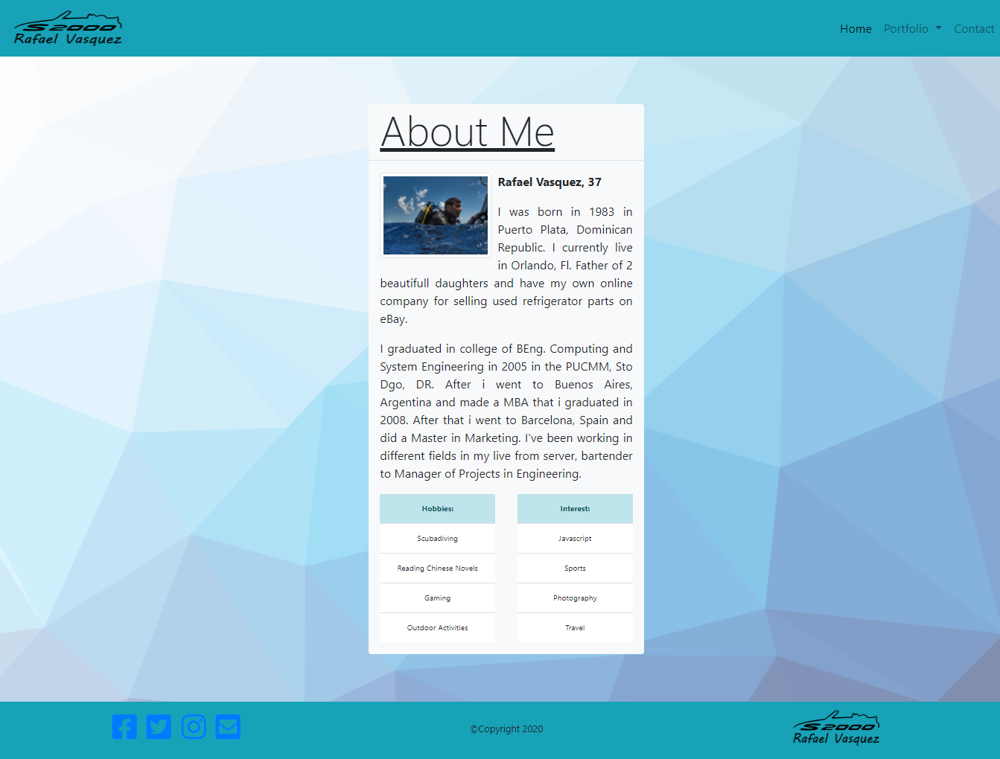
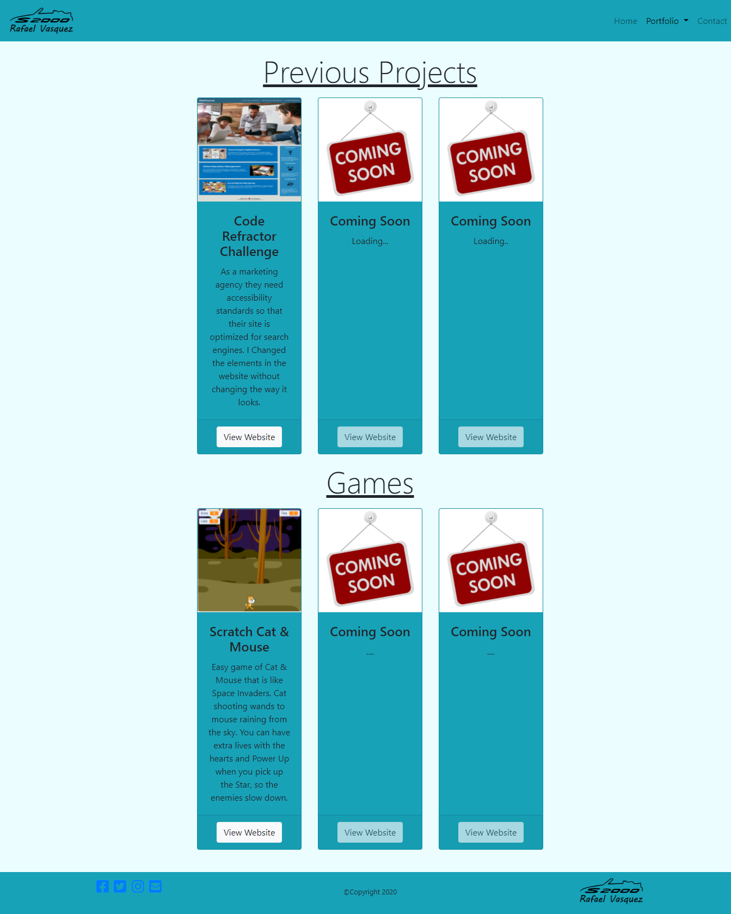
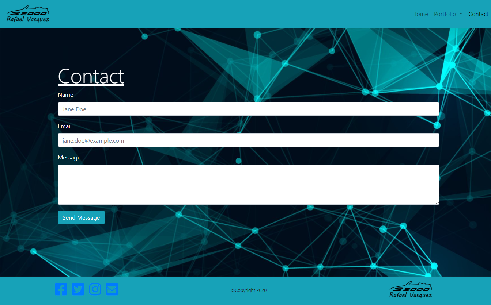

# Responsive Portfolio

### Purpose of the Second HW for Bootcamp

---
```
This is a portfolio website about Rafael Vasquez. Im a junior coder, just started the bootcamp. 
You can find here my past projects and past games i develop in the bootcamp. I hope you enjoy. 
```
### Built With
----
```
  * HTML
  * Bootstrap
  * Custom CSS
  * Font Awesome - icons
```    

### How to navigate
---
```
  1. Navbar links (Home - Portfolio dropdown - Contact)
  2. Logo in the navbar
  3. Logo in the footer
```

### Submission
---

Deployed URL: 
[https://v1zconde.github.io/Portfolio/](https://v1zconde.github.io/Portfolio/)

Github Repo URL: [https://github.com/v1zconde/Portfolio](https://github.com/v1zconde/Portfolio)

LinkIn: [https://www.linkedin.com/in/iamrafa/](https://www.linkedin.com/in/iamrafa/)

Resume: [Download](./assets/img/resume.pdf)

## Website
---
### Home Page
```
Here you can see the about page.
  * Navbar (Home Active)
    - Logo
    - Links to other pages
  * About me
    - d-flex with flex-column to make the colums on top of each other
  * Footer
    - Logo
    - Links to social media
    - Copyright
    - Fixed Footer
```

### Portfolio Page
```
Here you can see the about page.
  * Navbar (Portfolio active)
    - Logo
    - Links to other pages
  * Previous Projets & Games
    - Here you can see the projects im done so far, they are inside a card deck and each project as card.
  * Footer
    - Logo
    - Links to social media
    - Copyright
    - Fixed Footer
```

### Contact Page
```
Here you can see the about page.
  * Navbar (contact active)
    - Logo
    - Links to other pages
  * Contact
    - This is done with a form. Name and Email are required fields.
  * Footer
    - Logo
    - Links to social media
    - Copyright
    - Fixed Footer
```

